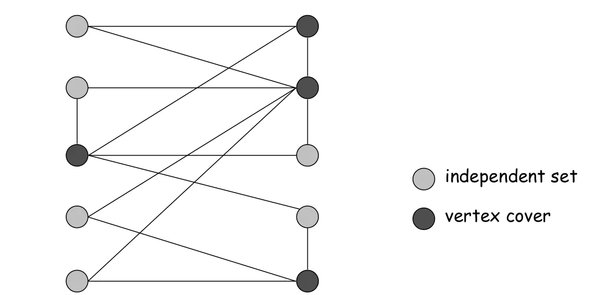

# 独立集（Independent set）

一个独立集（也称为稳定集）是一个图中**一些两两不相邻的顶点**所形成的集合，如果两个点没有公共边，那么这两个点可以被放到一个独立集中。换句话说，独立集 $S$ 由图中若干顶点组成，且 $S$ 中任两个顶点之间没有边。等价地，图中的每条边至多有一个端点属于 $S$ 。一个独立集的基数是它包含顶点的数目。

如下图中，所有灰色的点可以构成一个独立集，因为他们互相之间没有任何公共边。

> 对于三个点组成的完全图而言，每个点自身是一个独立集（且是最大独立集）；对四个点构成的四边形图而言，对角的两个点组成一个独立集（且是最大独立集）。

## 最大独立集
如果往图 $G$ 的独立集 $S$ 中添加任一个顶点都会使独立性丧失（亦即造成某两点间有边），那么称 $S$ 是**极大独立集**。

如果 $S$ 是图中所有独立集之中**基数最大**的，那么称 $S$ 是最大独立集，且将该基数称为 $G$ 的独立数，记为 $α(G)$ 。一般来讲，图 G 中可能存在多个极大独立集和最大独立集。

> 根据定义，最大独立集一定是极大独立集，但反之未必。

## 问题难度
给定一张图，寻找其中一个最大独立集的问题被称为最大独立集问题。该问题已知是 NP 困难的最优化问题，且即便试图以常数倍近似也是 NP 困难的。因此，计算机科学家普遍相信不存在解决该问题的高效算法，无论是精确求解还是以常数倍近似求解。

