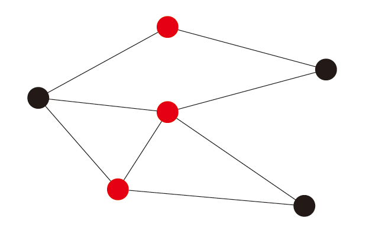
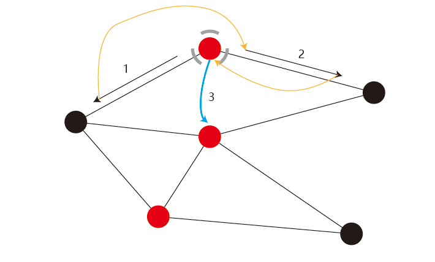
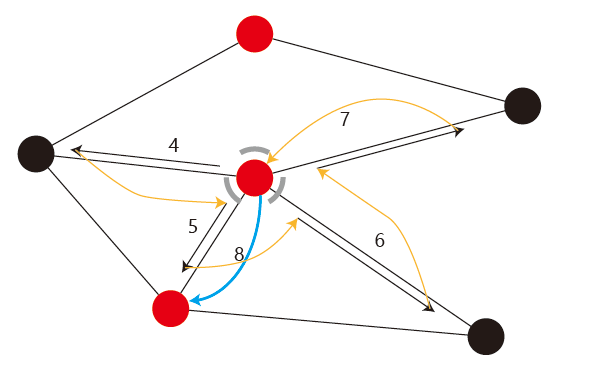
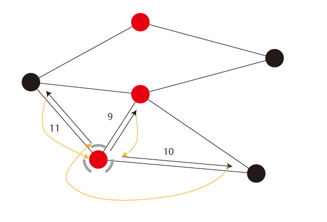
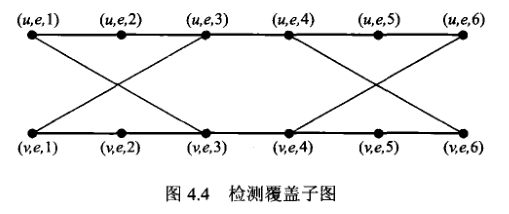
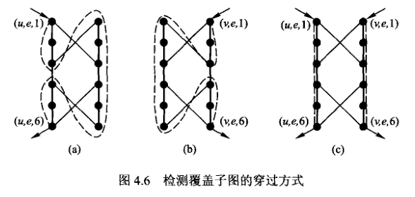
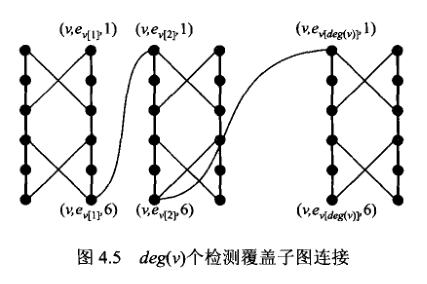

# 哈密顿回路（Hamiltonian Cycle, HC）
[哈密顿回路](./../GraphTheory/2.html) 问题的形式化定义如下：

**实例：** 无向简单图 $G=(V,E)$，其中 $V=\{v_1,v_2,...,v_n\}$。

**询问：** 图 G 中是否存在一条哈密顿回路。

该问题的证明思路是通过[顶点覆盖问题](./vc.html)归约证明。

## 核心思路

直接想太难了，从已知来推未知更容易理解一些。

下图为一个顶点覆盖图，红色的点是顶点覆盖集。

按照下面的步骤先把路径走一遍，先不用管合理性。

步骤是这样的，先走黑色的箭头，然后顺着黄色的箭头转到下一个序号的黑色箭头，**遍历完**定点覆盖点集的第一个点的所有边，然后顺着蓝色的箭头“瞬移”到第二个点。

按照相同的步骤，顺着黑色-黄色的顺序遍历完全部的和第二个点相连的边，然后顺着蓝色的箭头“瞬移”到第三个点。

同上，顺着黑黄的顺序遍历与第三个点相连的边。

观察上面的过程，可以发现几点。

 - 这一过程中，黄色的箭头和蓝色的箭头，他们的边在图上是没有的，是被想象构建出来的。
 - 点可能被重复覆盖了多次，但所有的实际的黑色的边，只走了一次或两次。

那下面就可以通过特殊的构造，将想象出的黄线和蓝线“合法化”。

首先，将所有的边换成下面这种图，叫做检测覆盖子图（也叫梯子图）：

会发现该类图存在一些特殊的和遍历相关性质。如果要**穿过子图所有的点将该图走一遍**，且只能**从序号为1的点开始**，**从序号为6的点结束**的话，那么走一遍的话只有两种走法，即下图 (a),(b)；走两遍的话只有一种走法，即下图(c)（分别走两边）。

之后，将于每个点相关联的边对应的检测子图上，按顺序穿起来（相邻的两个子图的起点和终点之间加一条边，最后一个子图的终点和第一个子图的起点之间加一条边），如下图：

随后，再在 K 个顶点之间，加一条边。

这样就完成了上面想象中的那种走法。一一对比，可以发现：

 - 如果遍历时相邻的点不在覆盖集合中，那么只需要走一次，相应的检测覆盖子图按照(a)/(b)的走法来到相邻的下一个检测覆盖子图，直到完成后回到起点。
 - 如果遍历时相邻的点也在覆盖集合中，那么这条边肯定需要，且最多遍历两次，那么相应的检测覆盖子图按照(c)的走法来到相邻的下一个检测覆盖子图上，直到完成后回到起点。

由此，如果存在顶点覆盖，则可以在检测覆盖子图和在其上附加的边中找一条哈密顿回路，反之同理。

> 直觉告诉我似乎漏了什么情况，但核心意图是这样子的，仅供理解。如果有问题或者确实没问题，欢迎 issue / pr 告知

## NPC 证明

暂略