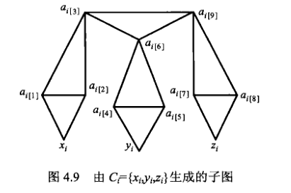

# 划分三角形问题

问能否将一个图完美的全部拆成一个个三角形，每个三角形的点互不重合。

---
**实例：** 图 $G=(V, E),|V|=3q, \quad q$ 为正整数。 

**询问：** 是否存在 $V$ 的一个划分,将 $V$ 分成互不相交的 $q$ 个子集 $V=V_{1} \cup V_{2} \cup \cdots \cup V_{q}$ ，
使 $\left|V_{i}\right|=3$, 且 $V_{i}$ 中的**三个顶点形成三角形**。

即设 

$$V_{i}=\left\{v_{i[1]}, v_{i[2]}, v_{i[3]}\right\}$$ 

则 
$$\left(v_{i[1]}, v_{i[2]}\right),\left(v_{i[2]}, v_{i[3]}\right) ,\left(v_{i[3]}, v_{i[1]}\right) \in E_{\circ}$$

---

该问题可以通过[X3C问题](x3c.html)归约证明。

## NPC 证明

令 X3C 问题实例为布尔变量集合 $S,|S|=3q$ 和项集合 $C,c_i={x_i,y_i,z_i},|C|=n$，以此构建划分三角形实例。

将**项集合** $C$ 中的每一个元素替换为如下的子图（命名为三角子图）

观察发现**该图最多能划分出四个三角形**（顶上一个，底下三个，注意划分出的三角形的点不能重复）。

而当**去除任意** $x,y,z$ 中的一个或多个点后（和点相邻的边也被同时去除了），该图最多只能划分出三个三角形。

因此，所有的项可以按照这种替换方式，被完全替换成一个图结构。令每一个项 $c_i$ 替换成的子图表示为 $G_i=\{V_i,E_i\}$，则划分三角形实例的图结构表示为 $G=\{V,E\}$，其中：

$$E=\bigcup_{i=1}^{n} E_{i},\left(x_{i}, y_{i}, z_{i}\right)=C_{i} \in C, |E_i|=18$$

易得$|E|=18n$

$$V=\bigcup_{i=1}^{n} V_{i}$$

注意每个子图的会额外在 X3C 布尔变量集合之外多定义 9 个点，即

$$V_i=\{x_i,y_i,z_i\}\cup\{a_{i[j]}|1\leq j\leq 9\}$$

同样易得点个数 $|V|=|S|+9n=3q+9n$

此时对于划分三角形实例，要求划分出的三角形个数 $q'=q+3n$（点个数的 1/3）

(->) X3C 实例存在一个严格覆盖 $C'$，则对位于严格覆盖$C'$中的项，等价选择三角子图划分出四个三角形的情况；对于不在严格覆盖中的项，等价选择三角子图划分出三个三角形的情况。$|C|=n$，因此一共是 n 个三角子图，$|C'|=q$ 因此有 $q$ 个三角子图划分出 4 个三角形，$n-q$ 个三角子图划分出了 3 个三角形，一共是 $4q+3(n-q)=q+3n$ 个三角形。

(<-) 假设图$G$可以划分出 $q+3n$ 个三角形。因为图 $G$ 中存在 $n$ 个**三角子图**（由项数决定），那么首先，肯定存在 $q$ 个三角子图划分出了 4 个三角形，其余的 $n-q$ 个三角子图划分出了 3 个三角形。

因为如果划分出4个三角形的三角子图数量不为 $q$（假设是 $q_1$ 个，那么最终的划分三角形个数即为 $4q_1+3(n-q_1)=q_1+3n \not= q+3n$ 。

那么对于这 $q$ 个三角子图$G_i$，对应选中 X3C 实例中的 $C_i=\{x_i,y_i,z_i\}$，因为划分方式唯一，且划分三角形点没有重复，因此对应到 X3C 中就可以构成对 $C$ 的严格覆盖。

得证。

